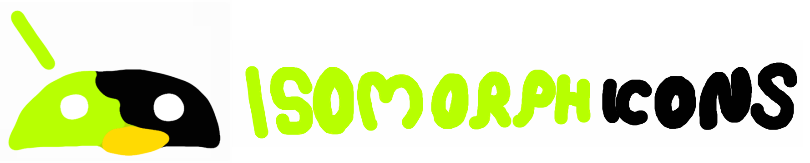
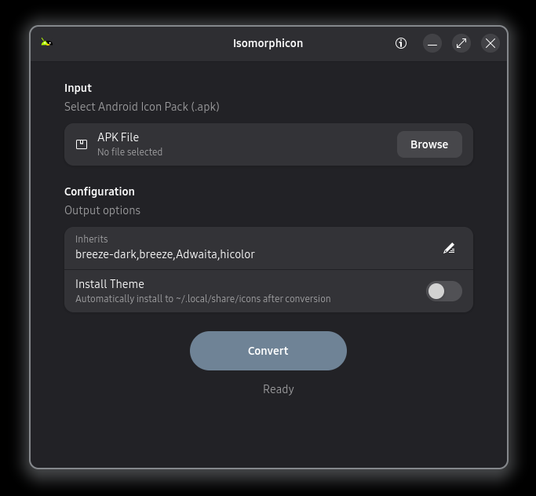

Extract and convert Android icon packs to Linux theme format.

Isomorphicon is a GTK4 application that automatically converts Android `.apk` icon packs into standard Linux icon themes compatible with KDE Plasma, GNOME, XFCE, and other desktop environments (or at least it *should*).




## Installation

Since this is not on Flathub yet, you have to build it yourself.

Building from source
Clone the repository: 

```bash
git clone https://github.com/vdoesui/Isomorphicon.git
cd Isomorphicon
```

Build and install the Flatpak: 
```bash
flatpak-builder --user --install --force-clean build_dir io.github.vdoesui.Isomorphicon.json
```

## Usage
Browse to select your .apk icon pack.

Inherits: Comma-separated list of parent themes (default: breeze-dark,breeze,Adwaita,hicolor).

Install Theme: Toggle this switch to automatically install the generated theme to ~/.local/share/icons/. (If "Install Theme" is OFF: The theme is saved to ~/Isomorphicon_Output/)

Click Convert.

*I've been trying to improve it as much as possible, however until literally every mapping has an exact match between android app and app package, and that includes variations like flatpak and stuff... there will be errors.*

## Output

Generated theme structure:

```
theme_name/
├── index.theme
├── apps/
│   └── 512x512/
└── places/
    └── 512x512/
```

## How it works

Isomorphicon processes Android icon packs in three phases:

- Parse official mappings from appfilter.xml and group candidate icons by package.
- Mildly intelligent search with fuzzy matching to find icons when official mappings don't exist.
- Extract remaining icons that weren't explicitly mapped in case they happen to match an unmapped app.

The fuzzy matcher scores files based on:
- Exact name match (1000)
- Full token match (800)
- Acronym match (600)
- Prefix match (500)
- Fuzzy substring match (0-100)

## Contributing

Contributions are welcome. The mapping definitions in `Config/mappings.json` can be improved by adding new applications or refining existing entries. If you find icons that aren't being matched correctly, feel free to submit improvements. The mappings are indeed as shitty as they look.

## Disclaimer

This software is provided as-is without warranty. The authors are not responsible for any damages caused by its use, including data loss or system issues. Use at your own risk.

## License
Isomorphicon is licensed under the European Union Public Licence v1.2 (EUPL-1.2).

Third Party: This software uses Apktool (Copyright © 2010 Ryszard Wiśniewski, Connor Tumbleson), licensed under the Apache License 2.0.

Icon themes are derivative works of the original Android icon packs and remain subject to their respective licenses, what you do, or can do, or can't do, is your problem. Check whatever the author says. (No apks or icon packs are included, but still, don't go around breaking icon pack copyright or whatever).
